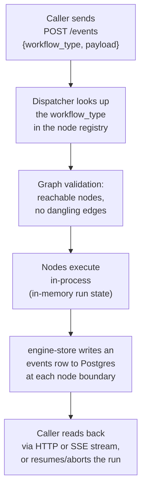

# engine-rs

A graph-validated **workflow execution engine**, written in Rust as an embeddable library rather
than a standalone service. It is the native execution core of **Bastion**, a private personal
practice-automation system ([bastion-os](https://github.com/bredmond1019/bastion-os) is the public
front door for that broader project) — but everything in this repo builds and tests entirely on
its own.

A **workflow** here is a directed graph of **nodes** (small, typed units of work — call an LLM,
write a file, hit an HTTP endpoint, wait on a timer) wired together with routing rules. **Graph
validation** means the engine checks a workflow's shape — reachable nodes, no dangling edges, a
declared entry point — before it ever runs, instead of failing mid-execution. Each run's state is
described by a **data contract**: a versioned, cross-language schema (shared with a Python
sibling system) for what a run record, a node result, and a usage/cost row look like on the wire
and in Postgres.

## What this is for

- **Running multi-step, possibly long-lived workflows** (an SDLC pipeline, a content pipeline, a
  research agent) as an in-process Rust runtime, instead of a chain of shell scripts or a
  Python event loop.
- **Holding run state in memory** for the process embedding it, while durably persisting a record
  of each node boundary to Postgres for crash recovery, history, and remote observers.
- **Being a case study in a from-scratch Rust rewrite of a Python engine**: `engine-core` is a
  parallel-pilot reimplementation of an existing Python orchestrator's core loop, built to prove
  out a typed, compiled alternative — see [docs/architecture.md](docs/architecture.md).

There is **no standalone `engine-rs` binary**. It is a set of libraries meant to be embedded in a
host process — see [docs/cli.md](docs/cli.md) and "No standalone binary" below.

## Quickstart

`Cargo.toml` declares three **relative path dependencies** — `../mev`, `../okf-core`,
`../claude-code-rs` — so a lone clone of this repo will not build. Clone all four repos as
siblings in one parent directory first:

```bash
mkdir bastion-workspace && cd bastion-workspace

git clone https://github.com/bredmond1019/mev
git clone https://github.com/bredmond1019/okf-core
git clone https://github.com/bredmond1019/claude-code-rs   # publishes to crates.io as claude-sdk-rs
git clone https://github.com/bredmond1019/engine-rs

cd engine-rs
cargo install cargo-nextest --locked   # one-time; this workspace's test runner

cargo build --workspace                # build every crate
cargo nextest run --workspace          # run the full test suite (no live services needed)
```

That's it — no database, no external service, no `.env` file is required to build or run the
default test suite.

### Prerequisites

| Need | Why | If it's missing |
|---|---|---|
| Rust (stable, edition 2021) | Compiles the workspace | Install via [rustup](https://rustup.rs) |
| `cargo-nextest` | The test runner this workspace is authored against (see [docs/testing.md](docs/testing.md)) | `cargo install cargo-nextest --locked` |
| Sibling clones of `mev`, `okf-core`, `claude-code-rs` | Three path dependencies in [`Cargo.toml`](Cargo.toml) resolve as `../mev`, `../okf-core`, `../claude-code-rs` | Clone each next to `engine-rs`, per the layout above |
| PostgreSQL (optional) | Only for a small number of `#[ignore]`d live round-trip tests in `engine-store` | Not needed for the default suite; see "Testing" below to opt in |

## Workspace crates

| Crate | What it does |
|---|---|
| [`engine-contract`](crates/engine-contract) | Shared data-contract types — `EventsRow`, `TaskContext`, `NodeRun`, journal rows — the Rust port of the shape both this engine and its Python sibling write to Postgres. See [docs/data-contract.md](docs/data-contract.md). |
| [`engine-core`](crates/engine-core) | The runtime itself: the `Node` trait, the node registry, dispatch, the built-in workflow graphs (SDLC pipelines, content pipeline, research agent, and more), and the cron/schedule primitive. |
| [`engine-store`](crates/engine-store) | Postgres persistence for `events`/journal rows via `sqlx`, plus orphaned-run detection for crash recovery. |
| [`engine-serve`](crates/engine-serve) | The actix-web HTTP surface (trigger a run, stream/read results, pause/resume/abort) and in-memory live run state. This is the crate a host process embeds. |
| [`term-core`](crates/term-core) | tmux session control (session lease, capture, guarded input) used by workflow nodes that drive a terminal. |
| [`term-attach`](crates/term-attach) | The blocking terminal-attach path, kept in its own crate so it can never be pulled into `engine-core`/`engine-serve` by additive Cargo feature unification. |

## How a run flows through the engine



1. A host process (or an external caller) sends `POST /events` to `engine-serve`'s HTTP surface
   with a `workflow_type` and a payload.
2. The `Dispatcher` in `engine-core` looks up that `workflow_type` in its node/workflow registries
   and builds the graph for that run.
3. Before executing anything, the engine validates the graph's shape — every node is reachable,
   every edge points at a real node, there is exactly one entry point.
4. Nodes execute in-process, one after another (or in parallel branches), holding their state in
   memory for as long as the host process runs.
5. At each node boundary, `engine-store` asynchronously writes an `events` row (and, where
   relevant, a journal row) to Postgres — the durable record used for crash recovery, history, and
   any remote observer catching up on a run in progress.
6. A caller reads results back over HTTP, or over a server-sent-events stream for a live run, and
   can pause, resume, or abort a run through the same HTTP surface.

## No standalone binary

There is no `main.rs` anywhere under `crates/` — `engine-serve` is a library meant to be linked
into a host binary that calls `engine_serve::init_tracing()` and mounts its HTTP routes. See
[docs/cli.md](docs/cli.md), which documents this explicitly and is the place a future CLI's
synopsis/subcommands would land if one is ever added.

## Testing

All commands below are typed in a shell, from the repo root, after the Quickstart's clone step:

```bash
cargo nextest run --workspace                        # authoritative: unit + integration tests
cargo nextest run --lib --workspace                   # fast signal: unit tests only
cargo nextest run -p engine-core <module::path>       # just the module you're touching
cargo fmt --check && cargo clippy -- -D warnings       # formatting + lints
cargo build --release                                  # release build (the fourth CI gate)
```

**Avoid plain `cargo test`** — this workspace's test layout (one integration-test binary per crate,
documented in [docs/testing.md](docs/testing.md)) is authored against `cargo nextest run`, which
runs every test in its own process; `cargo test` collapses them into threads of one process and can
surface false failures from shared global state that nextest avoids by design.

A small number of `engine-store` tests are `#[ignore]`d because they need a live PostgreSQL
instance (**destructive**: they insert and update real rows against whatever database you point
them at):

```bash
DATABASE_URL=postgres://... cargo test -p engine-store -- --ignored
```

They are skipped by default specifically so the default suite above needs no database at all.

## Architecture and the data contract

- [docs/architecture.md](docs/architecture.md) — the full module map, core types (`Node`,
  `NodeRegistry`, `Dispatcher`), and how this rewrite relates to its Python predecessor.
- [docs/data-contract.md](docs/data-contract.md) — the canonical, versioned schema this repo
  authors for `events`/`node_runs`/journal rows, the field-by-field mapping to `engine_contract`
  Rust types, and the conformance test that pins this repo's shapes against a real fixture from
  the Python sibling system rather than a hand-authored one.

## CI

[`.github/workflows/ci.yml`](.github/workflows/ci.yml) is a thin caller into a shared, reusable
Rust gate workflow (hosted in the `bredmond1019/agentic-base-template` repo). It runs
`cargo nextest run --workspace`, `cargo fmt --check`, `cargo clippy`, and `cargo build --release`,
and because of the three path dependencies above, it checks out `mev`, `okf-core`, and
`claude-code-rs` as sibling repos before building — the same layout as the Quickstart above.

## Troubleshooting

| Symptom | Likely cause | What to check |
|---|---|---|
| `failed to load source for dependency 'mev'` (or `okf-core`/`claude-code-rs`) | The three sibling repos aren't cloned, or aren't adjacent to `engine-rs` | Re-check the clone layout in Quickstart — all four repos must share one parent directory |
| `cargo test` reports failures that don't reproduce under `nextest` | Plain `cargo test` runs tests as threads in one process; some tests assume nextest's per-test process isolation | Use `cargo nextest run --workspace` instead — see "Testing" above |
| `#[ignore]`d Postgres test panics with `DATABASE_URL must be set` | You ran it with `-- --ignored` without setting `DATABASE_URL` | Either don't pass `--ignored`, or set `DATABASE_URL` to a real (disposable) Postgres instance first |
| `cargo-nextest: command not found` | The test runner isn't installed | `cargo install cargo-nextest --locked` |

## See also

- [docs/index.md](docs/index.md) — full documentation index, including per-workflow reference
  docs (content pipeline, research agent, SDLC graphs, and more).
- [docs/architecture.md](docs/architecture.md), [docs/testing.md](docs/testing.md),
  [docs/data-contract.md](docs/data-contract.md), [docs/cli.md](docs/cli.md)
- Sibling repos this workspace depends on: <https://github.com/bredmond1019/mev>,
  <https://github.com/bredmond1019/okf-core>, <https://github.com/bredmond1019/claude-code-rs>

## License

Licensed under either of

- Apache License, Version 2.0 ([LICENSE-APACHE](./LICENSE-APACHE) · <http://www.apache.org/licenses/LICENSE-2.0>)
- MIT license ([LICENSE-MIT](./LICENSE-MIT) · <http://opensource.org/licenses/MIT>)

at your option. Unless you explicitly state otherwise, any contribution intentionally submitted
for inclusion in this work by you, as defined in the Apache-2.0 license, shall be dual licensed
as above, without any additional terms or conditions.

Built for one operator and released because it may be useful to others — there is no support
obligation, no issue-response SLA, and no stability promise.
