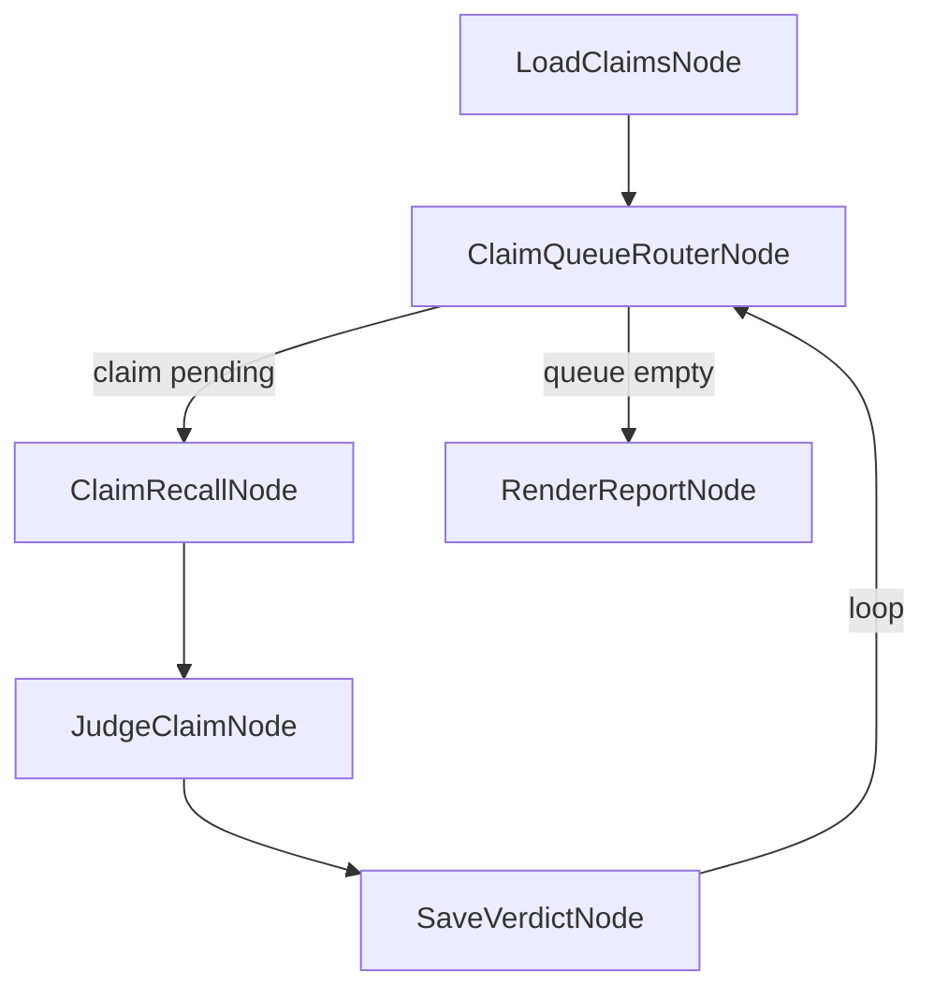

# `CLAIM_REAFFIRM`

Re-checks every **stale distilled claim** — a `knowledge.md`/`memory.md` D35 entry past its
`freshness:` threshold, the same set the `/attention` board's "Stale distilled knowledge" lane
shows — against fresh corpus evidence, and writes one markdown proposal report a human reviews. The
engine only ever *proposes* here: nothing in this workflow writes back into `knowledge.md` or
`memory.md`. A human (or a follow-up tool) applies whatever the report recommends.

## Quickstart

Typed in a **terminal**:

```bash
curl -X POST $ENGINE/events/ \
  -H "X-API-Key: $ENGINE_EVENTS_API_KEY" \
  -H 'Content-Type: application/json' \
  -d '{"workflow_type":"CLAIM_REAFFIRM","data":{}}'
```

`data: {}` runs production discovery — every repo in the brain registry, every stale claim found.
Watch it, then read the report:

```bash
curl -s $ENGINE/events/$EVENT_ID | jq              # final state
curl -N  $ENGINE/events/$EVENT_ID/stream           # live progress (SSE)
cat planning/artifacts/claim-reaffirm/report.md     # the proposal — overwritten each run
```

| Must exist first | Why | If missing |
|---|---|---|
| `BRAIN_API_URL` (+ optional `BRAIN_API_KEY`) | `ClaimRecallNode`'s evidence lookup needs a `BrainConfig` | Registration fails fast with a clear error, before any claim is touched |
| A registered brain (`brain.toml`) with `knowledge.md`/`memory.md` files | `LoadClaimsNode` scans every registered repo for stale entries | An empty claim set — the run still succeeds, with an empty report |

**Trigger discipline:** by hand via `POST /events/`, never cron — this is a review pass an operator
asks for, not a scheduled chore.

## The shape



1. **`LoadClaimsNode`** resolves the brain root and every registered repo, reads each repo's
   `planning/knowledge.md`/`planning/memory.md`, and keeps the entries mev's own staleness
   predicate (`distill_stale_age`) flags — identical to what `/attention`'s distilled lane shows,
   so this run's queue can never diverge from the board. `ClaimReaffirmInput::lane_source_override`
   bypasses discovery with an explicit claim list, for a caller re-running a known subset.
2. **`ClaimQueueRouterNode`** dispatches the next pending claim (or routes to `RenderReportNode`
   once the queue is empty), resolving `ClaimReaffirmPolicy` fresh each pass.
3. **`ClaimRecallNode`** fetches corpus evidence for that claim via the same `RECALL` seam
   ([`recall.md`](recall.md)) — identifier-anchored, with recall failure contained per claim
   rather than halting the run.
4. **`JudgeClaimNode`** judges the claim with one model call against the fetched evidence,
   proposing an action: `BumpFreshness`, `Supersede`, `Archive`, or `NeedsHuman`. If recall
   returned no evidence, the action is forced to `NeedsHuman` — the model cannot choose
   `BumpFreshness`/`Supersede` on an empty evidence set. This is a structural guard in the node,
   not a prompt instruction the model could ignore.
5. **`SaveVerdictNode`** is the loop's sole state writer: it records the `Verdict`, retries a
   failed claim up to `policy.max_attempts` times, then marks it `Failed` and moves on rather than
   halting the whole lane.
6. The loop repeats until the queue is empty, then **`RenderReportNode`** writes every claim's
   outcome — judged verdict or exhausted-retries failure — as one markdown report.

## Policy

Four-layer resolution, same as every other workflow: per-run event `policy` override > named
`profile` > `planning/harness.json`'s `claim_reaffirm.policy` defaults > built-in default. See
[policy-and-profiles.md](policy-and-profiles.md) for the general mechanism.

| Knob | What it trades | Built-in default |
|---|---|---|
| `max_attempts` | Retries per claim before giving up and marking it `Failed` | `3` |
| `judge_model_tier` | Which model tier `JudgeClaimNode` calls | `Sonnet` |
| `recall_limit` | How many corpus evidence hits `ClaimRecallNode` fetches per claim | `5` |

| Profile | `max_attempts` | `judge_model_tier` | `recall_limit` |
|---|---|---|---|
| `baseline` | 3 | `Sonnet` | 5 |
| `cheap-fast` | 1 | `Haiku` | 3 |
| `thorough` | 5 | `Opus` | 10 |

```bash
curl -X POST $ENGINE/events/ \
  -H "X-API-Key: $ENGINE_EVENTS_API_KEY" \
  -H 'Content-Type: application/json' \
  -d '{"workflow_type":"CLAIM_REAFFIRM","data":{"profile":"cheap-fast"}}'
```

## The report

Written to `planning/artifacts/claim-reaffirm/report.md`, relative to the resolved brain root — a
**fixed** filename, overwritten each run, not a per-run/timestamped log. This is the only file the
workflow writes; unlike `EN.7.A`'s `MaterializeDocNode` seam, it does not materialize a tracked
Brain source document, just a plain markdown proposal for a human to read.

## Cost ceiling and resuming a large lane

A hundreds-of-claims lane can halt against the default `$5`/run ceiling
(`ENGINE_RUN_MAX_COST_USD`) before draining the whole queue. `SaveVerdictNode`'s read-modify-write
state means a re-trigger against the same claim set skips every already-`Judged` claim — so
re-triggering after a partial drain (optionally narrowing `lane_source_override` to the remainder)
resumes rather than re-judging from scratch. Note the general resume-budget caveat for loop-heavy
workflows (`crates/engine-core/src/budget.rs`): a resumed run's cost accounting does not
necessarily carry the aborted run's spend forward byte-for-byte.

## What is deliberately not here

- **No write-back to `knowledge.md`/`memory.md`.** The engine only ever proposes; applying a
  verdict is a human or a separate tool's job.
- **No `ParallelNode`.** The queue drains one claim at a time — inherited hard constraint, guarded
  by a standing regression test in `graph.rs`.

## Troubleshooting

| Symptom | Likely cause | What to check |
|---|---|---|
| Registration fails before any claim runs | Missing/invalid `BRAIN_API_URL` | `BrainConfig::from_env` — same construction-time check `RECALL` uses |
| Run halts partway through a large claim set | Hit `ENGINE_RUN_MAX_COST_USD` | Re-trigger the same event; already-`Judged` claims are skipped |
| A claim's verdict is always `NeedsHuman` | Recall returned no evidence for it | `ClaimRecallNode`'s query and the underlying `RECALL` seam ([recall.md](recall.md)) |
| Report file missing or stale | Run never reached `RenderReportNode`, or wrote to a different path | `planning/artifacts/claim-reaffirm/report.md` under the resolved brain root |

## See also

- [`recall.md`](recall.md) — the Brain evidence-lookup seam `ClaimRecallNode` reuses.
- [`policy-and-profiles.md`](policy-and-profiles.md) — the general four-layer precedence mechanism.
- [`workflows-readme`](README.md) — the full capability catalogue.
- [`../architecture.md`](../architecture.md) — where this workflow's crates and seams fit.
