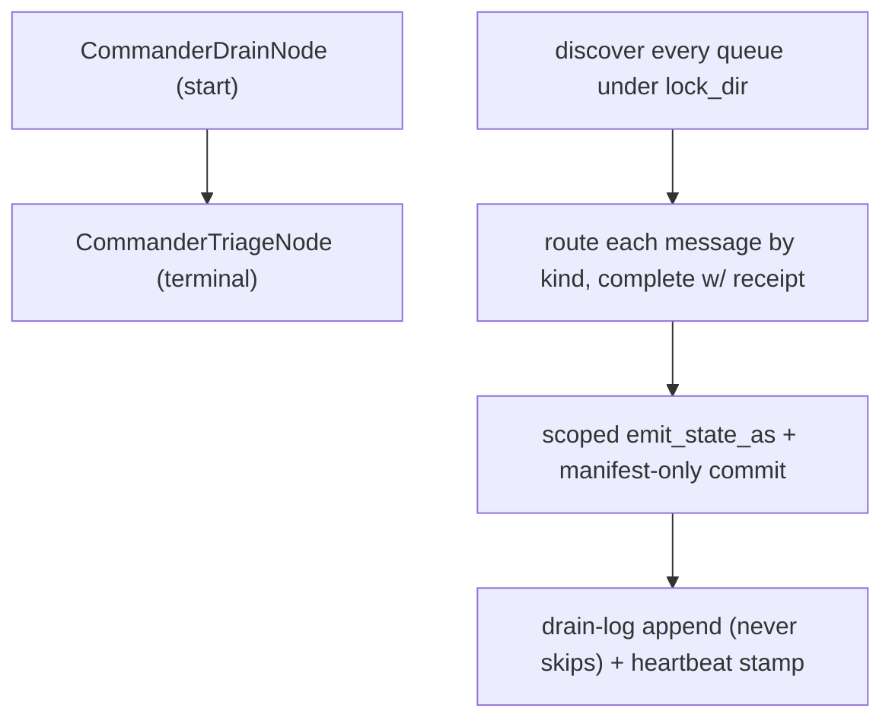

# `COMMANDER`

Runs one full fleet drain pass as a registered engine workflow, instead of the
`/orchestration-commander` skill's hand-driven loop. `COMMANDER` discovers **every** lane's inbox
under the fleet lock dir — not just the caller's own — routes each message by kind and completes
it with a receipt, emits scoped state and commits only the resulting manifest, appends a drain-log
row that never skips, stamps a heartbeat, then runs the block's one gated triage step.

Ported from `scripts/drain_log.py`'s `discover_queues`/drain loop (`EN.15.F`). The scar this exists
to close: the Python commander drained only its own inbox and reported "drained 0" for **thirteen**
consecutive passes while three messages — one P0 — sat unread.

## Quickstart

Typed in a **terminal**:

```bash
curl -X POST $ENGINE/events/ \
  -H "X-API-Key: $ENGINE_EVENTS_API_KEY" \
  -H 'Content-Type: application/json' \
  -d '{"workflow_type":"COMMANDER","data":{"root":"/path/to/agentic-portfolio","repo":"engine-rs","agent":"my-agent"}}'
```

| `data` field | Required | Default if omitted |
|---|---|---|
| `root` | yes | — (fleet root, e.g. `agentic-portfolio/`) |
| `repo` | yes | — |
| `agent` | yes | — (also the default `heartbeat_name`) |
| `dir` | no | `root/<repo>` |
| `lock_dir` | no | `root/.fleet-locks` |
| `roadmap` | no | none — a drain with no roadmap still writes a `roadmap: null` drain-log row |
| `drain_log_path` | no | `root/planning/roadmaps/<roadmap>/drain-log.jsonl` when `roadmap` resolves, else `<lock_dir>/commander-drain-log.jsonl` |
| `heartbeat_name` | no | `agent` |
| `now` | no | the real current instant (RFC3339) |
| `profile` | no | the default permission profile — gates the triage step, see below |
| `model` | no | `claude-code-rs`'s own default |

Registering `COMMANDER` (`register_commander`, `crates/engine-serve/src/workflows.rs`) makes it
dispatchable over `POST /events/` above. It does **not** schedule it anywhere —
`planning/harness.json`'s `schedule.entries` stays `[]`, and `base-template/scripts/commander_drain.sh`
is unmodified and keeps running on its own cadence.

## The shape



1. **`CommanderDrainNode`** (start) — one pass, four steps, all re-derived from disk on every
   call (no cursor, no cache):
   - Discover and drain **every** queue under `lock_dir`, routing each message by
     `okf_core::MessageKind` through a priority lookup that reproduces the `ping-agent` skill's
     Rule 3 interrupt discipline: `RENDEZVOUS`/`LEASE_RELEASE` = P0, `EDGE_RELEASED` = P1,
     `FINDING` = P2, `QUERY` = P3 (an unreadable/unparseable kind falls back to P3 rather than
     erroring or dropping the message). Completes each with a receipt in priority order within
     the pass.
   - Run the scoped `mev::emit_state_as` call for `repo`/`agent`, then commit **only** the
     resulting `I_EMIT_WROTE` manifest paths — never a `git add -A` sweep. A foreign-lease
     refusal (`E_QUIESCE_LEASE_HELD`) is reported on `ctx.nodes`, never retried.
   - Append one drain-log summary row (`roadmap: null` when `roadmap` didn't resolve — the log
     never skips a pass) plus every not-yet-mirrored receipt/message row.
   - Stamp the commander heartbeat at `<lock_dir>/commander-heartbeats/<heartbeat_name>.heartbeat`
     as a bare epoch-second integer. `commander_drain.sh` may still stamp the same file;
     last-writer-wins by design.
2. **`CommanderTriageNode`** (terminal) — the block's **one** gated `AgentCodeStep`: orphan
   classification against the manifest from step 1, plus a check against
   `planning/open-work/index.md` before filing anything fresh.

## The one gated step, and why it can be suppressed

`CommanderTriageNode` resolves `profile`/`model` fresh from `ctx.event` on **every** run — never
baked into the graph at registration. It checks `GatedAction::RunDrain` via
`crate::policy::permission::decide`:

| Profile | `RunDrain` | What happens |
|---|---|---|
| `Standard`, `Locked` | `Deny` | The step is skipped and **recorded**, not dropped: `ctx.nodes["commander-triage"] = {"suppressed_by_profile": true}` |
| `Unrestricted` | `Permit` | The one real `AgentCodeStep` runs |

The constructed `claude_code_rs::Config` never sets `dangerously_skip_permissions` — this step is
never invoked with a permissions bypass, checked independently of the gate outcome via
`triage::triage_config`.

## What is deliberately not here

- **No second `AgentCodeStep`.** Every other judgement step the old `/orchestration-commander`
  prompt performed is out of scope for this port (see the block record's `out_of_scope`) — this
  module must never grow one.
- **Real orphan detection is the triage step's job, not the drain node's.** `CommanderDrainNode`'s
  `DrainSummary` always stamps `orphan_inbox`/`orphan_processing`/`orphan_receipts` as `0`.
- **No cursor, no "last seen" marker.** Every function re-reads the tree from scratch on each
  call — the property that makes draining an unchanged tree twice a safe no-op.

## Troubleshooting

| Symptom | Likely cause | What to check |
|---|---|---|
| Emit reports `"status": "refused"` | Another lane holds the repo's quiesce lease | The refusal `reason` on `ctx.nodes["CommanderDrainNode"].emit` |
| Triage step never runs | `profile` resolved to `Standard`/`Locked` (the default) | Pass `"profile":"unrestricted"` in the event, and confirm `ctx.nodes["commander-triage"].suppressed_by_profile` |
| Drain-log row missing a roadmap | No `roadmap` in the event | Expected — the row is written with `roadmap: null`, not skipped |
| A message never gets drained | It sits under a lane's inbox outside `lock_dir` | `discover_queues` only walks the tree rooted at `lock_dir` |

## See also

- [`orchestration.md`](orchestration.md) — `OrchestrationRunNode`'s own per-block `CoordHandle`
  drain, a narrower mechanism than this workflow's fleet-wide pass.
- [`architecture.md`](../architecture.md) — where `COMMANDER` sits in the module map.
- `commander-retro` / `ping-agent` skills — the operator-facing procedures this workflow ports.
