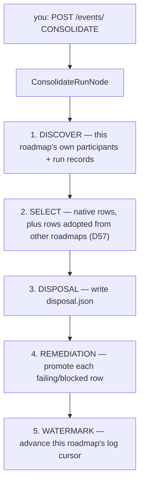

# `CONSOLIDATE`

Closes the loop on one roadmap's finished orchestration runs. `CONSOLIDATE` reads every
`orchestration-run/<roadmap>/` record the corpus has for a roadmap, decides which ledger rows
actually belong to it (a row can be *adopted* from a different roadmap's log — see D57 below),
writes `disposal.json` for the first time, promotes any failing/blocked row into HQ's remediation
registry, and advances that roadmap's watermark so the next run does not re-read what this one
already consumed.

It is a Rust port of `/consolidate-run` (`EN.15.K`) — a slash command still exists for the
interactive path; this workflow is the same mechanism dispatched over HTTP.

## Quickstart

Typed in a **terminal**:

```bash
curl -X POST $ENGINE/events/ \
  -H "X-API-Key: $ENGINE_EVENTS_API_KEY" \
  -H 'Content-Type: application/json' \
  -d '{
    "workflow_type": "CONSOLIDATE",
    "data": {
      "brain_root": "/Users/brandon/Dev/agentic-portfolio",
      "roadmap_slug": "coordination-layer-port"
    }
  }'
```

`brain_root` and `roadmap_slug` are the only two required fields. Everything else has a sane
default — see the table below.

| Field | Required | Default when absent |
|---|---|---|
| `brain_root` | yes | — (the run fails without it) |
| `roadmap_slug` | yes | — (the run fails without it) |
| `hq_root` | no | same as `brain_root` |
| `since` (RFC 3339 timestamp) | no | no lower bound — every participant is included |
| `run_id` | no | the dispatcher's own run id, or a fresh UUID |
| `disposal_path` | no | `<roadmap dir>/disposal.json`, or `<brain_root>/planning/open-work/orchestration-runs/disposal-<roadmap_slug>.json` if the roadmap directory does not resolve |
| `analysis` | no | `"CONSOLIDATE run for <roadmap_slug>"` |
| `backfilled` | no | `false` |
| `ungrounded_excludes` | no | `[]` |
| `watermark_to_line` | no | the log's current end (every line consumed) |

Then read the result off the run's final `task_context` (or the SSE stream — see
[README.md](README.md)'s Quickstart for both). The node's own result carries
`selected_row_count`, `disposal_path`, `disposal_row_count`, `promotions`, and the
`watermark` outcome.

## The shape



A single node, both start and terminal — no router, mirroring the [`terminal-probe.md`](terminal-probe.md)
/ [`commander.md`](commander.md) micro-workflow shape. **You do step 1** (the `curl`, or a chain
step dispatching `CONSOLIDATE`); everything below it is the engine, in this fixed order:

1. **Discover** — walks `orchestration-run/<roadmap_slug>/` records, cross-checks them against
   `lane-log.jsonl`'s participants, and dedups by realpath.
2. **Select** — applies D57's two-axis `origin_roadmap` rule: a row *native* to `roadmap_slug` is
   gated on its record's lifecycle; a row *adopted* into `roadmap_slug` from a different driving
   lane's record (the D57 worked example: `close-the-loop` carrying two `carryover-improvements`
   blocks) is included regardless of that lifecycle. `--since` scoping (via `since`) only ever
   governs a native row — an adopted row's inclusion is the driving lane's own business, never
   `roadmap_slug`'s log.
3. **Disposal** — writes `disposal.json` at `disposal_path` through `okf-core`'s disposal type,
   for the first time (not merely proposed).
4. **Remediation** — for every selected row whose raw ledger entry is failing or blocked and
   carries a `remediation` object, promotes it into HQ's `docs/sandbox/remediation.json` +
   `findings.json`, minting the next `REM-NNN` id. The overwhelming majority of rows are never
   failing tests, so this step is silently skipped for them — that is expected, not an error.
5. **Watermark** — advances `roadmap_slug`'s consolidation watermark to `watermark_to_line` (or
   the log's current end), refusing on hash drift rather than re-basing. Skipped entirely if the
   roadmap directory does not resolve.

## What is deliberately not here

- **No policy module, no profiles, no `harness.json` section.** `ConsolidateRunNode` calls no
  model — every stage is a pure, already-tested Rust function (discovery, selection, disposal
  write, remediation promote, watermark advance). There is no `ModelTier` to resolve, so
  `engine-serve`'s registration function resolves no policy and seeds no policy stamp, matching
  [`terminal-probe.md`](terminal-probe.md) / [`recall.md`](recall.md) / `HARVEST_APPROVE`.
- **Extraction and mechanism naming stay `ClaudeCodeStep`s.** They are genuinely LLM work and are
  never part of this declared graph — this workflow covers only the mechanical join and the
  artifact writers around it.
- **`promote_remediation` still shells out to `python3`** (the existing `check_remediation.py` /
  `render_*.py` writers) — it is the one stage in this graph that is not pure Rust.

## D57 — the two-axis selection rule

D57 is `base-template/planning/decisions/D57-orchestration-run-artifact-contract.md`. Its worked
example is what step 2 above implements: a block finished under one roadmap's orchestration run
can still belong to a *different* roadmap's disposal — because the lane that drove it was working
that other roadmap. Reading only `roadmap_slug`'s own directory would silently drop such a row;
this node also lists every other roadmap directory the corpus has and unions in whatever selects
for `roadmap_slug`.

## Troubleshooting

| Symptom | Likely cause | What to check |
|---|---|---|
| Run fails with "missing required field `brain_root`" (or `roadmap_slug`) | Event omitted a required field | The Quickstart's field table above |
| `disposal_row_count` is 0 | The roadmap directory has no run records yet, or every row was already consumed past the watermark | `discovery_findings` in the node's result, and the roadmap's `lane-log.jsonl` |
| A row you expected is missing | It may be adopted into a *different* roadmap, not this one — D57 selection is per-roadmap | Re-run `CONSOLIDATE` against the roadmap that actually drove that block |
| `promotions` is empty | Expected for a clean run — most disposal rows were never a failing test | The raw ledger entry's `status` and whether it carries a `remediation` object |
| Watermark step is `null` in the result | The roadmap directory did not resolve for `roadmap_slug` | `brain_root`'s `planning/roadmaps/<roadmap_slug>` (or legacy `planning/<roadmap_slug>`) path |

## See also

- [README.md](README.md) — the capability catalogue and how any workflow is triggered.
- [`orchestration.md`](orchestration.md) — the runs this workflow consolidates after the fact.
- [`commander.md`](commander.md) — another dispatchable, not-scheduled maintenance workflow, same
  micro-workflow shape.
- `base-template/planning/decisions/D57-orchestration-run-artifact-contract.md` — the two-axis
  `origin_roadmap` selection rule.
