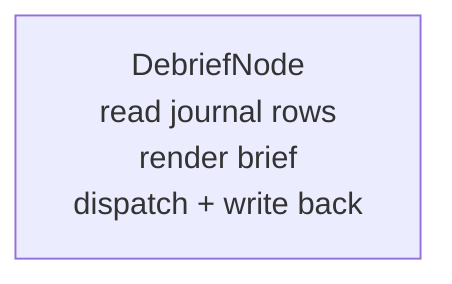

# `DEBRIEF`

Turns one campaign's [journal](../architecture.md) — the durable decision log an `ORCHESTRATION`
run writes as it goes — into a single readable text brief: every step, in order, every bail named
with its reason. Point it at a campaign id and it hands back what happened overnight, readable on
a phone.

## Quickstart

```bash
curl -X POST $ENGINE/events/ \
  -H "X-API-Key: $ENGINE_EVENTS_API_KEY" \
  -H 'Content-Type: application/json' \
  -d '{"workflow_type":"DEBRIEF","data":"<campaign-uuid>"}'
```

The campaign id is the **only** input. `data` may be the bare UUID string above, or an object with
a `campaign_id` field (`{"data":{"campaign_id":"<campaign-uuid>"}}`) — same two-shape convention as
`RECALL`'s query field. No conductor, chain, roadmap, or lane is involved; `DEBRIEF` is dispatchable
on its own.

| Must exist first | Why |
|---|---|
| A campaign with journal rows | `DEBRIEF` reads `GET /campaigns/{id}/journal`'s underlying data via an injected `JournalReader`; an empty or unknown campaign renders an empty brief, not an error |
| `DATABASE_URL` configured on the serving process | With no pool, the live `JournalReader` self-skips to an empty row set (mirrors the durable write path's own no-DB self-skip) rather than erroring |

Read the rendered brief back the same way you'd read any journal entry:

```bash
curl $ENGINE/campaigns/<campaign-uuid>/journal -H "X-API-Key: $ENGINE_EVENTS_API_KEY"
```

Look for the row with `kind: "DebriefRendered"` — its detail payload holds the text.

## How it works

One node, both start and terminal:



1. Resolve the campaign id out of `ctx.event`.
2. Fetch that campaign's journal rows through the injectable `JournalReader` trait (`engine-core`
   depends only on `engine-contract`, so it cannot call `engine_store` directly — the same reason
   `HttpGet`/`HttpPost` are injectable rather than direct calls; see
   [`../architecture.md`](../architecture.md) § Injectable Seams).
3. Render one deterministic text digest, steps in `created_at` order, every `StepBailed` /
   `GateRefused` / `StateWriteVerificationFailed` / `BudgetHalted` row naming its reason in the
   text — this is enforced in code (`brief_names_every_bail`), not left to a summarizing model.
4. Dispatch that digest to `CONTENT_PIPELINE` over the existing `ChannelTransport` seam, for
   downstream delivery. This leg is **fire-and-forget** — every `OutboundBody::TriggerWorkflow`
   dispatch in this codebase is (see [`../architecture.md`](../architecture.md) § Injectable Seams
   for `ChannelTransport`) — so `DebriefNode` never waits on it and never reads a result back from
   it.
5. **Separately, synchronously**, write the same digest back as a
   `JournalDecisionKind::DebriefRendered` journal row through the injected journal-sink seam. This
   is why the digest reads back through `GET /campaigns/{id}/journal` reliably: the text a reader
   gets is the text this node itself produced, not whatever the fire-and-forget
   `CONTENT_PIPELINE` run does with it.

The production wiring (`register_debrief`, `crates/engine-serve/src/workflows.rs`) uses the live
`JournalReader` (`journal::journal_reader_live`) and the live `ChannelTransport`. Its journal-sink
is unset at dispatch time — a `Dispatcher` factory closure runs before the serving process's
Postgres pool exists (the same gap `ORCHESTRATION`'s own `StepFanoutContext` documents) — so a
production run's brief is dispatched and rendered, but the synchronous write-back needs a live
sink wired in; see [`../architecture.md`](../architecture.md) for the current state of that gap.

## No policy, no profiles

`DebriefNode` calls no model — it renders from journal data deterministically, so there is nothing
for a policy layer to act on. Same no-op carve-out as `TERMINAL_PROBE` and `RECALL`.

## See also

- [README.md](README.md) — the capability catalogue.
- [`../architecture.md`](../architecture.md) — the Journal section (`JournalDecisionKind`, the
  read route) and the `DEBRIEF` module entry.
- [orchestration.md](orchestration.md) — how a campaign and its journal rows come to exist in the
  first place.
