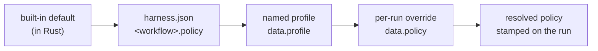

# Policy, profiles, and local models

Every knob that trades **cost, latency or quality** — which model each stage uses, how verbose
prompts are, retry and fetch bounds, whether an optional enrichment step runs — lives on a
workflow's **policy**. None of it is hardcoded, and you never edit Rust to change it.

This page is the cross-workflow mechanism. For SDLC_FLOW's specific knob list, see
[sdlc-flow-policy.md](sdlc-flow-policy.md); each workflow's own doc lists its knobs and profiles.

## Quickstart

Pick a named profile at trigger time — the one-line version:

```bash
curl -X POST $ENGINE/events/ \
  -H "X-API-Key: $ENGINE_EVENTS_API_KEY" \
  -H 'Content-Type: application/json' \
  -d '{"workflow_type":"SDLC_TASK","data":{"profile":"cheap-fast", "...":"..."}}'
```

(`cheap-fast` is not universal — see the per-workflow table below for what each one accepts.)

Override a single field for one run, without a profile:

```bash
  -d '{"workflow_type":"CONTENT_PIPELINE","data":{"policy":{"verbosity":"terse"}, "...":"..."}}'
```

Change the default for every run in this repo — edit the workflow's section in
`engine-rs/planning/harness.json`, e.g. `content_pipeline.policy`.

## Which setting wins: four layers

Resolved once per run, at dispatch. Later layers beat earlier ones, field by field — a `None` in a
higher layer falls through rather than blanking the value below it.



In sentences:

1. **Built-in default** — what the code ships with. Always behavior-stable: adding a knob never
   changes what an existing run does.
2. **`harness.json`** — this repo's defaults, under the workflow's own key (`sdlc`, `sdlc_task`,
   `research_agent`, `content_pipeline`, …). Absent for a run with no repo checkout, which is fine.
3. **A named profile** — a bundle of settings picked by name in the event's `profile` field.
4. **A per-run override** — the event's `policy` object. Highest precedence; wins over everything.

The merge is `resolve<P>` in [`policy/resolve.rs`](../../crates/engine-core/src/policy/resolve.rs);
the `harness.json` reading and profile lookup are in
[`policy/profiles.rs`](../../crates/engine-core/src/policy/profiles.rs). The resolved value is
stamped into `ctx.nodes` under `ResolvedPolicy`, so every downstream node reads one value instead
of re-deriving it — and so telemetry can attribute cost to the setting that caused it.

## Named profiles

A **profile** is a named bundle of policy settings, so you can say "run this cheaply" instead of
listing eight fields.

**Profile names are per-workflow and they are not uniform** — do not assume `cheap-fast` exists
everywhere, because it does not. The full set, read from each workflow's `profiles.rs`:

| Workflow | Profiles it accepts |
|---|---|
| `SDLC_FLOW` | `baseline` · `cheap-fast` · `thorough` · `pragmatist` · `batch-reviewer` |
| `SDLC_TASK` | `baseline` · `cheap-fast` · `thorough` |
| `RESEARCH_AGENT` | `baseline` · `cheap-fast` · `thorough` |
| `DIAGNOSTIC_INTAKE` | `baseline` · `cheap-fast` · `thorough` · **`local-extract`** |
| `PROPOSAL_GENERATOR` | `baseline` · `cheap-fast` · `thorough` · **`local-judgment`** · `skip-review` |
| `DELIVERABLE_RENDER` | `baseline` · `cheap-fast` · `thorough` |
| `CONTENT_PIPELINE` | `baseline` · `cheap-fast` · `thorough` · `fast-summarize` · **`local-drafting`** · `curated-harvest` |
| `LINKEDIN_POST` | `baseline` · `cheap-fast` · `thorough` |
| `APPROVE_AND_RUN` | `baseline` · `cheap-fast` · `thorough` |

The common three, where a workflow has them:

- **`baseline`** — an explicit no-op, identical to passing nothing. Useful to state intent.
- **`cheap-fast`** — the cost and latency floor: cheaper tiers, terser prompts, tighter bounds.
- **`thorough`** — the quality ceiling.

**The bolded three are the ready-made local-model profiles** — see the next section.

## Running a stage on a local model

Yes, this exists. A stage can be pointed at an **OpenAI-compatible endpoint** instead of a cloud
model, via the `Local` model tier.

The four tiers, from [`policy/tier.rs`](../../crates/engine-core/src/policy/tier.rs):

| Tier | Resolves to |
|---|---|
| `sonnet` | `claude-sonnet-4-5` |
| `haiku` | `claude-haiku-4-5` |
| `opus` | `claude-opus-4-8` |
| `local` | Whatever `LocalConfig.model` names, over `LocalConfig.endpoint` |

`LocalConfig` has three fields, defaulting to Ollama:

| Field | Default | What it does |
|---|---|---|
| `endpoint` | `http://localhost:11434` | Base URL of the OpenAI-compatible server |
| `model` | `qwen2.5-coder:7b` | Model name to request |
| `constrained_json` | `false` | Pass the stage's JSON schema as a constrained-decoding `response_format`, and skip the JSON-repair retry for that stage |

**No stage defaults to `local`** — the code says so explicitly. It is opt-in.

**The easiest way in is a ready-made profile.** Three workflows ship one that already rewires a
stage onto the local tier, so you need no policy JSON at all:

| Profile | Workflow | What it moves local |
|---|---|---|
| `local-extract` | `DIAGNOSTIC_INTAKE` | The `extract` stage, with constrained JSON on |
| `local-judgment` | `PROPOSAL_GENERATOR` | `opportunity`, `review` and `revise`. The `writer` stage stays cloud-default |
| `local-drafting` | `CONTENT_PIPELINE` | `summarize`, `critic`, `revise` and `translate`, with constrained JSON on |

```bash
  -d '{"workflow_type":"DIAGNOSTIC_INTAKE","data":{"profile":"local-extract", "...":"..."}}'
```

Anything else is a manual rewire: set that stage's tier to `local` and supply a `LocalConfig`,
through `harness.json` or a per-run `policy` override. Check the workflow's own doc for its stage
names before writing the override.

## Which workflows have a policy section

These keys exist in `engine-rs/planning/harness.json` today:

`sdlc` · `sdlc_task` · `research_agent` · `diagnostic_intake` · `proposal_generator` ·
`content_pipeline` · `linkedin_post` · `deliverable_render` · `orchestration` ·
`approve_and_run` · `email_adapter` · `operator_queue` · `run_failure_notification` ·
`orphan_recovery` · `rate_card`

`LEAD_INGEST`, `OPPORTUNITY_SET_STAGE`, `OPPORTUNITY_ADD_ACTION` and `TERMINAL_PROBE` have **no
policy at all** — none of their nodes calls a model, so there is no tier to resolve and nothing for
a policy layer to override.

## Troubleshooting

| Symptom | Likely cause | What to check |
|---|---|---|
| A profile name is accepted but nothing changes | Profile names are per-workflow; an unknown one may resolve to no bundle | Check that workflow's own doc for its profile list |
| A `policy` override seems ignored | A higher layer is not overriding — `data.policy` is the highest layer, so the field name is likely wrong | Compare against the workflow's knob table; a `None` falls through rather than erroring |
| Local tier produces malformed JSON | `constrained_json` is `false`, so no schema is passed and the repair retry is skipped for that stage | Set `constrained_json: true` in `LocalConfig` |
| Policy resolution fails on a channel-triggered run | There is no repo checkout to read `harness.json` from | Expected — that path resolves builtin + profile + event layers only |

## See also

- [README.md](README.md) — the capability catalogue.
- [sdlc-flow-policy.md](sdlc-flow-policy.md) — SDLC_FLOW's knob list, profiles and telemetry.
- [`../architecture.md`](../architecture.md) — where the policy module sits in the crate layout.
