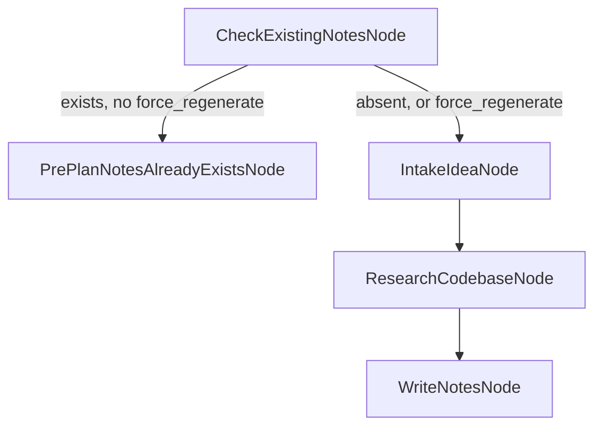

# Pre-Plan Workflow

- Turns a short `{idea, slug}` payload into a real `notes.md` in the same shape a human running
  [`/capture`](../../.claude/commands/capture.md) would produce → [§Graph shape](#graph-shape)
- **Disabled by default** — a dispatch needs an explicit `profile` or `policy.enabled: true` or it
  gets a `403`-equivalent refusal, nothing runs → [§Policy](#policy-prepplanpolicy)
- Trigger over HTTP with one `curl` call → [§Quickstart](#quickstart)
- Re-dispatching a `slug` whose `notes.md` already exists short-circuits — no research, no
  overwrite, unless you pass `force_regenerate: true` → [§Idempotency](#idempotency)
- The research step is read-only by construction and defends against prompt injection in the idea
  text itself → [§Prompt-injection defense](#prompt-injection-defense)

Source: `crates/engine-core/src/workflows/pre_plan/` (`mod.rs`, `check_existing.rs`, `intake.rs`,
`research.rs`, `write_notes.rs`, `prompts/research_codebase.md`), registered from
`crates/engine-serve/src/workflows.rs`'s
[`register_pre_plan`](../../crates/engine-serve/src/workflows.rs) →
`register_builtin_workflows`. HTTP route:
[`crates/engine-serve/src/pre_plan_webhook.rs`](../../crates/engine-serve/src/pre_plan_webhook.rs).
Block record: `EN.19.A`.

## Quickstart

What must exist first:

| Prerequisite | Why |
|---|---|
| A deployed, rebuilt `bastion serve` | The webhook route is compiled in at build time, not picked up live — see [§Deploy boundary](#deploy-boundary) |
| `$ENGINE` pointed at it | Same convention as every other workflow — see [README.md § Quickstart](README.md#quickstart) |
| `X-API-Key` | Same header every mutating route checks |
| A `profile` or `policy.enabled: true` in the payload | The kill switch — see [§Policy](#policy-prepplanpolicy) |

```bash
export ENGINE=http://localhost:8080   # or :8090 — confirm against your own plist

curl -X POST $ENGINE/webhooks/pre-plan/inbound \
  -H "X-API-Key: $ENGINE_EVENTS_API_KEY" \
  -H 'Content-Type: application/json' \
  -d '{"idea":"a short free-text idea","slug":"idea-slug","profile":"baseline"}'
# -> 202 {"run_id":"...","event_id":"..."}
```

Result lands at `$BRAIN_ROOT/planning/open-work/pre-plan/idea-slug/notes.md`.

## Graph shape



1. `CheckExistingNotesNode` — the start node — checks whether the target `notes.md` already exists.
2. Exists and no `force_regenerate` → `PrePlanNotesAlreadyExistsNode`, a terminal that reports the
   existing path. Nothing else runs.
3. Otherwise → `IntakeIdeaNode` → `ResearchCodebaseNode` → `WriteNotesNode` (both terminal
   identities are declared with zero outgoing connections — `write_notes::NODE_NAME` and
   `check_existing::EXISTS_ROUTE`).

| Node | Model call? | What it does |
|---|---|---|
| `CheckExistingNotesNode` | No | `Path::exists()`-checks `<brain_root>/planning/open-work/pre-plan/<slug>/notes.md`; never writes. Also a [`Router`](../../crates/engine-core/src/routing.rs) — `route()` reads back the verdict `process()` stamped. |
| `PrePlanNotesAlreadyExistsNode` | No | Short-circuit terminal. Re-reports `CheckExistingNotesNode`'s stamped `notes_path` under its own identity (`check_existing::EXISTS_ROUTE`). |
| `IntakeIdeaNode` | No | Validates `idea`/`slug` are non-empty strings; carries through optional `channel`/`sender`. Fails loudly, naming the missing field. |
| `ResearchCodebaseNode` | Yes (`Sonnet` by default, policy-tunable) | A read-only [`AgentCodeStep`](../../crates/engine-core/src/nodes/agent_code_step.rs) scoped to `Read`/`Grep`/`Glob` only. Stable prompt: [`prompts/research_codebase.md`](../../crates/engine-core/src/workflows/pre_plan/prompts/research_codebase.md). |
| `WriteNotesNode` | No | Renders the research findings into OKF frontmatter + sections matching `capture.md`'s output shape, and writes `notes.md`. Does not re-check existence — the graph already routed around that case. |

No node here assumes it is the first node of a run — this is deliberate, so a future composing
workflow (`EN.19.D`) can reuse the same node set inside a larger graph, not only reach it through
the standalone `PRE_PLAN` `workflow_type`.

## Event payload

```json
{
  "idea": "a short free-text idea",
  "slug": "idea-slug",
  "channel": "telegram",
  "sender": "operator",
  "force_regenerate": false,
  "profile": "baseline",
  "policy": { "research_model_tier": "opus" }
}
```

| Field | Required | Notes |
|---|---|---|
| `idea` | Yes | Non-empty string. Treated as **untrusted, external input** — see [§Prompt-injection defense](#prompt-injection-defense). |
| `slug` | Yes | Non-empty string. Also the idempotency key and the `notes.md` directory name. |
| `channel` / `sender` | No | Passed through unchanged; no dedicated typed event schema yet — `IntakeIdeaNode` reads these directly off the raw event JSON. |
| `force_regenerate` | No, default `false` | `true` skips the existing-notes short-circuit and overwrites. |
| `profile` | No | Named `PartialPrePlanPolicy` bundle — see [§Policy](#policy-prepplanpolicy). |
| `policy` | No | Inline `PartialPrePlanPolicy` override — highest precedence. |

## Policy: `PrePlanPolicy`

- Two knobs: `enabled` (the kill switch) and `research_model_tier` (`ResearchCodebaseNode`'s cloud
  model tier, resolved through the shared
  [`llm_node::resolve_meta_transport`/`wire`](../../crates/engine-core/src/workflows/llm_node.rs)
  seam per CLAUDE.md standing rule 11 — never a hand-rolled transport field).
- **Built-in default is `enabled: false`.** Every canonical profile below flips it `true` — a run
  reaches `PRE_PLAN` at all only by naming one of them, or by an inline `policy.enabled: true`.
- Same four-layer precedence as every other policy-bearing workflow (see
  [policy-and-profiles.md](policy-and-profiles.md)): event `policy` override > event `profile` >
  `planning/harness.json`'s `pre_plan.policy` defaults > built-in default — resolved by
  `resolve_policy_for_run_from` in
  [`pre_plan/mod.rs`](../../crates/engine-core/src/workflows/pre_plan/mod.rs).
- **The webhook route resolves against `PolicyConfigSource::Builtin`** (no filesystem access at
  dispatch time — same as `RESEARCH_AGENT`/`DIAGNOSTIC_INTAKE`), so `planning/harness.json`'s
  `pre_plan.policy` defaults are **never actually read at dispatch time**; that section exists for
  documentation parity and for a future non-webhook caller resolving against a worktree.

Named profiles (`profile_by_name` in `pre_plan/mod.rs`; `planning/harness.json`'s `pre_plan.profiles`
can override any bundle by name):

| Profile | `research_model_tier` |
|---|---|
| `baseline` | `sonnet` |
| `cheap-fast` | `haiku` |
| `thorough` | `opus` |

`registry_for_policy(&policy)` never changes which node identities are registered across any
setting — only `ResearchCodebaseNode`'s transport is rewired (CLAUDE.md standing rule 6).

## Idempotency

- `CheckExistingNotesNode` is the guard, not a webhook-level check — it runs inside the graph
  itself, so it is exercised identically no matter what dispatches the run.
- Existing `notes.md` + no `force_regenerate` → short-circuits at
  `PrePlanNotesAlreadyExistsNode`. Zero research calls, file untouched.
- Existing `notes.md` + `force_regenerate: true` → proceeds through the full graph and overwrites.
- The webhook route adds one more layer above the graph: a **same-slug in-flight conflict guard**
  (`in_flight_pre_plan_slug_conflict` in `pre_plan_webhook.rs`) — a second dispatch for a `slug`
  with an already-live (non-terminal) `PRE_PLAN` run gets `409` before anything is dispatched.
  Unrelated concurrent slugs are unaffected; general concurrent-dispatch protection beyond this
  same-slug case is explicitly out of scope for `EN.19.A`.

## Prompt-injection defense

The idea text is **external, untrusted input** — it may come from a Telegram message or a public
form, not just an operator. `ResearchCodebaseNode`'s defense is layered:

- **Tool scope, not model discipline.** `Config.allowed_tools` is exactly `[Read, Grep, Glob]`;
  `disallowed_tools` includes `Write`/`Bash`/`Edit`. Even if the model complies with an injected
  instruction, no tool exists to act on it.
- **Explicit refusal instruction.** The stable prompt
  ([`prompts/research_codebase.md`](../../crates/engine-core/src/workflows/pre_plan/prompts/research_codebase.md))
  tells the model to refuse any embedded instruction to write, run a command, change tool scope, or
  reveal secrets — and to note that an injection attempt was observed.
- **Every claim tagged `VERIFIED` or `ASSUMED`.** `WriteNotesNode::ensure_tagged` wraps any
  untagged research output in a documented `ASSUMED` fallback, so the guarantee holds even if the
  model's own output drifts from the prompt's tagging instruction.

Exercised end-to-end by
[`crates/engine-core/tests/it/pre_plan.rs`](../../crates/engine-core/tests/it/pre_plan.rs)'s
`prompt_injected_idea_produces_no_file_outside_notes_md` — asserts the only file written under the
brain root is the target `notes.md` itself.

## Deploy boundary

Registering `POST /webhooks/pre-plan/inbound` (`pre_plan_webhook.rs`) and calling
`register_pre_plan` are **source changes** — landing them on `main` does not make the route live
against a currently-running `bastion serve`. That process must be rebuilt
(`cargo build --release`) and restarted before the route answers anything but a `404`. `EN.19.A`
task 7 states this obligation explicitly so it is never silently assumed automatic.

## Reading outputs

- **`<brain_root>/planning/open-work/pre-plan/<slug>/notes.md`** — the rendered document:
  OKF frontmatter (`type: Note`, `title`, `description`, `doc_id`, `layer: [meta]`, `status: draft`,
  `created`/`updated`, `keywords`) followed by `What & Why` / `Context & Background` /
  `Key Information / Instructions` / `Open Questions` / `Provenance` sections, matching
  `capture.md`'s Output Format.
- **`ctx.nodes["WriteNotesNode"]["notes_path"]`** on the final `TaskContext` — the same path.
- **`ctx.nodes["PrePlanNotesAlreadyExistsNode"]`** — `{notes_path, already_exists: true}` when the
  run short-circuited instead.

## Error surface

| Condition | Outcome |
|---|---|
| Missing/invalid `X-API-Key` | `401`, nothing dispatched |
| Missing or empty `idea`/`slug` | `400` naming the field, nothing dispatched |
| Another live `PRE_PLAN` run already has this `slug` | `409`, nothing dispatched |
| Policy resolves `enabled: false` (no `profile`/`policy.enabled` on the event) | Dispatch factory returns an `Err` — nothing spawned |
| Otherwise | `202 {run_id, event_id}` — `event_id` always equals `run_id`, matching `POST /webhooks/email/inbound`'s contract |

## Out of scope (`EN.19.A`)

- **No embedding/pgvector/corpus writes** — per THE BOUNDARY TEST (`CLAUDE.md`), this workflow only
  acquires and reasons; it writes a plain `.md` file, not a Brain ingest.
- **General concurrent-dispatch protection** beyond the same-slug in-flight guard above.
- **A dedicated typed event schema** — `profile`/`policy` are read directly off `ctx.event`'s raw
  JSON today, unlike e.g. `DIAGNOSTIC_INTAKE`'s `DiagnosticIntakeEventSchema`.
- **Composing this node set into a larger graph** — reserved for `EN.19.D`; the node set is built
  reusable-first (see [§Graph shape](#graph-shape)) but no composing workflow exists yet.

## See also

- [README.md](README.md) — the full capability catalogue and `$ENGINE` Quickstart.
- [`.claude/commands/capture.md`](../../.claude/commands/capture.md) — the human-driven command
  whose output shape `WriteNotesNode` matches.
- [policy-and-profiles.md](policy-and-profiles.md) — the shared four-layer policy framework.
- [research-agent.md](research-agent.md) — another `PolicyConfigSource::Builtin`, dispatch-time
  policy resolution example.
