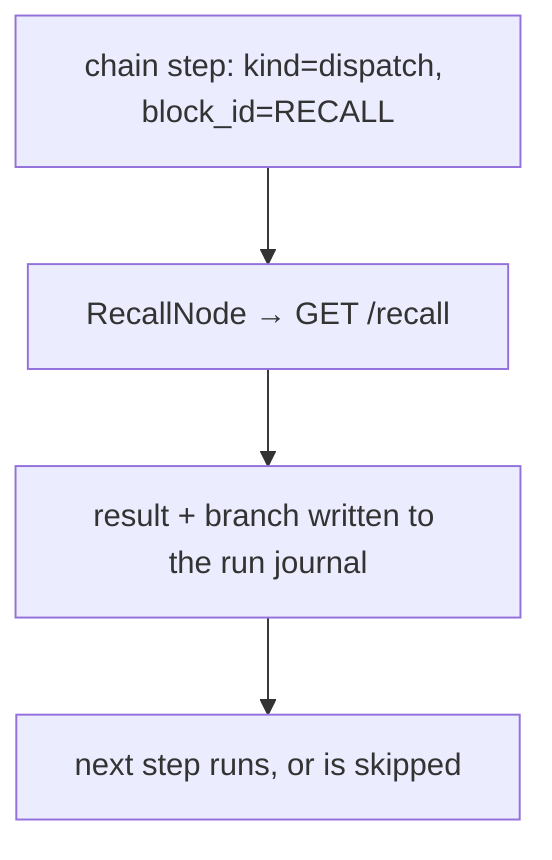

# `RECALL`

Asks the Brain a question in the middle of a run. `RECALL` queries Synapse's `GET /recall` and puts
the result where a later chain step can act on it — so a chain can look something up instead of
carrying everything it needs in its own event payload.

Authorized by [D23](../../planning/decisions/D23-brain-read-seam.md), which permits this direction
of the boundary under four constraints. The engine is a **typed consumer only**: it never ranks,
never re-scores, never embeds. Retrieval stays wholly Synapse's.

## Quickstart

Typed in a **terminal**:

```bash
curl -X POST $ENGINE/events/ \
  -H "X-API-Key: $ENGINE_EVENTS_API_KEY" \
  -H 'Content-Type: application/json' \
  -d '{"workflow_type":"RECALL","data":"how does the push gate order repos?"}'
```

`data` may be the bare query string above, or an object with a `query` field
(`{"data":{"query":"..."}}`) — the same two-shape convention `DEBRIEF` uses for its campaign id.

| Must exist first | If it does not |
|---|---|
| `BRAIN_API_URL` — Synapse's base URL, e.g. `http://localhost:8000` | Construction fails with a clear error before the node runs, not mid-run |
| `BRAIN_API_KEY` — the `X-API-Key` value | Optional. A local Brain with `require_api_key` off needs none; a warning is logged, not an error |
| Synapse reachable and serving `GET /recall` | The step bails. An unreachable Brain is **never** treated as an empty result |

## The shape



1. A chain step whose `kind` is `dispatch` and whose `block_id` is `RECALL` runs this workflow.
2. `RecallNode` calls `GET /recall?q&limit&hybrid` over the injectable `HttpGet` seam.
3. The response is deserialized against the `RecallResponse` shape Synapse pins — field for field.
4. A `RecallConsulted` row goes to the run journal carrying the query, the count, the top score,
   and **which branch it caused**.
5. If the recall returned nothing, the next chain step is skipped. Otherwise it runs.

**You personally do step 1** — by authoring the chain step, or by the `curl` above. Everything else
is the engine.

## Why it is a dispatch step and not a new step kind

`RECALL` plugs into `WORKFLOW_DISPATCH` ([`EN.12.E`](../../planning/blocks/EN.12.E.json)) rather
than adding a fourth `StepKind`. `ChainStep` is a hand-maintained mirror of mev's
`brain::lane_segments` grammar with no shared dependency between the two repos, so a new variant
would be a cross-repo vocabulary addition that mev must also learn to emit. A dispatch step needs
none.

## What is deliberately not here

- **No policy module, no profiles, no `harness.json` section.** `RecallNode` calls no model, so
  there is no `ModelTier` to resolve.
- **`limit` and `hybrid` are builder args, not `Policy` knobs.** They are closer to a call site's
  fixed shape than a per-run cost/latency/quality trade — the "where feasible" carve-out in
  `CLAUDE.md` standing rule 6. The reasoning is recorded in `crates/engine-core/src/nodes/brain_client.rs`.
- **No ranking, fusion, scoring or decay.** Those live behind the endpoint and stay Synapse's, per
  brain D51/D53. Reaching for an embedding call here means the work is on the wrong side of the
  boundary.

## Troubleshooting

| Symptom | Likely cause | What to check |
|---|---|---|
| Step bails with "brain recall request failed" | Synapse unreachable, or wrong `BRAIN_API_URL` | `curl -H "X-API-Key: $BRAIN_API_KEY" "$BRAIN_API_URL/recall?q=test"` |
| Step bails naming the pinned contract | Synapse changed the `GET /recall` response shape | The conformance fixture at `crates/engine-core/tests/fixtures/recall_response.json` |
| The next step ran when you expected a skip | The recall returned at least one result | The `RecallConsulted` journal row's `count` and `branch` fields |
| HTTP 401 | Missing or wrong `BRAIN_API_KEY` | Whether Synapse has `require_api_key` enabled |

## See also

- [`debrief.md`](debrief.md) — reads the journal rows this workflow writes into.
- [`orchestration.md`](orchestration.md) — the chain that dispatches this step.
- [D23](../../planning/decisions/D23-brain-read-seam.md) — the ruling that permits the read seam.
- [D9](../../planning/decisions/D9-engine-brain-boundary.md) — the outbound half of the boundary.
- [`architecture.md`](../architecture.md) — where the run journal fits.
