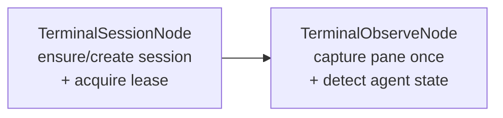

# `TERMINAL_PROBE`

A **diagnostic**, not business work. It exercises the read-only terminal nodes end to end: make
sure a tmux session exists, take its lease, capture the pane once, and report what state the agent
in that pane appears to be in.

It **never sends keystrokes and never waits.** If you want the engine to actually drive a terminal
session, that is the rest of the terminal node stack — see [`../terminal-nodes.md`](../terminal-nodes.md).

Use it to answer "can the engine see my tmux at all?" before debugging anything more complicated.

## Quickstart

```bash
curl -X POST $ENGINE/events/ \
  -H "X-API-Key: $ENGINE_EVENTS_API_KEY" \
  -H 'Content-Type: application/json' \
  -d '{"workflow_type":"TERMINAL_PROBE","data":{ ... }}'
```

| Must exist first | Why |
|---|---|
| `tmux` on the host running the engine | The default registry uses the live `TmuxDriver`, which shells out to real `tmux` |

The event fields are those the two terminal nodes read; see
[`../terminal-nodes.md`](../terminal-nodes.md) for the session-identity fields rather than a copy
that can drift from it.

## How it works

Two nodes, no router:



1. **`TerminalSessionNode`** (start) ensures or creates the tmux session and acquires its lease.
2. **`TerminalObserveNode`** (terminal) captures the pane a single time and detects agent state.

Both nodes share **one injected `TerminalDriver`** — deliberately, because they must talk to the
same tmux server. `TerminalObserveNode`'s `session_input` is left unbound, so it defaults to the
identity `TerminalSessionNode` is registered under and resolves with no explicit binding.

The graph is assembled with `Workflow::new_validated`, so a structurally unsound graph fails loudly
at assembly rather than mid-run.

## No policy, no profiles

Neither node calls a model. `TerminalObserveNode`'s one knob (`PaneTailPolicy`) is **derived
internally** from whether the upstream session was adopted — it is not a cost/latency/quality knob
a run would want to override, so there is nothing for a policy layer to act on. This is the
explicit "where feasible" carve-out in the repo's nodes-are-configurable standing rule, not an
oversight.

## See also

- [README.md](README.md) — the capability catalogue.
- [`../terminal-nodes.md`](../terminal-nodes.md) — the full terminal node stack, its invariants and defaults.
- [`../terminal-driver.md`](../terminal-driver.md) — the `TerminalDriver` seam, the session lease, and the operator hold.
- [`../terminal-crates.md`](../terminal-crates.md) — why `term-core`/`term-attach` are two crates.
